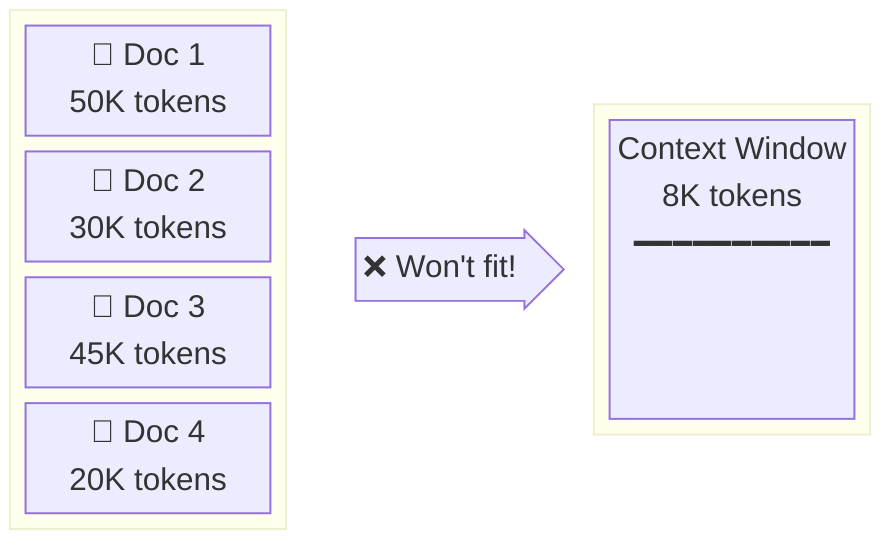
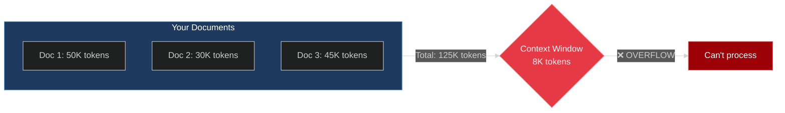
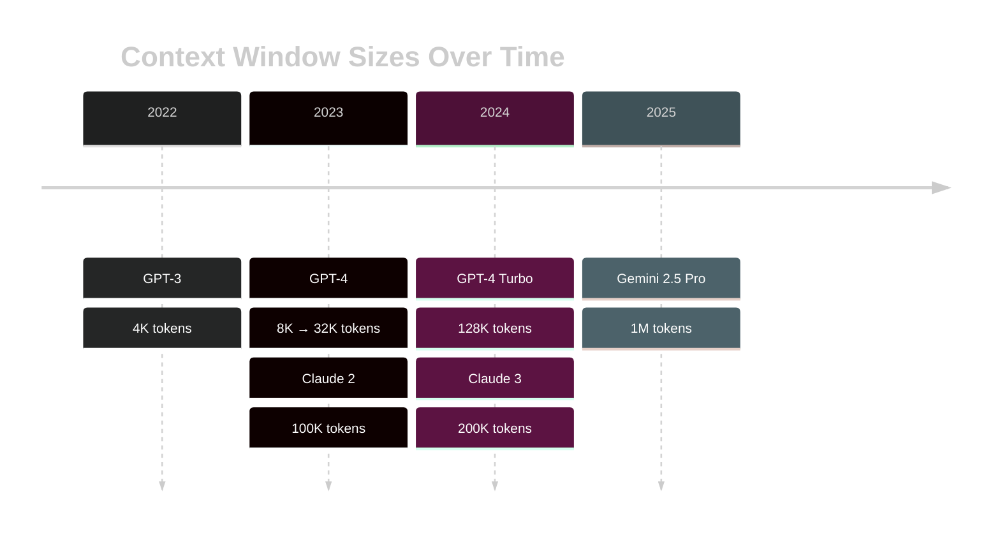
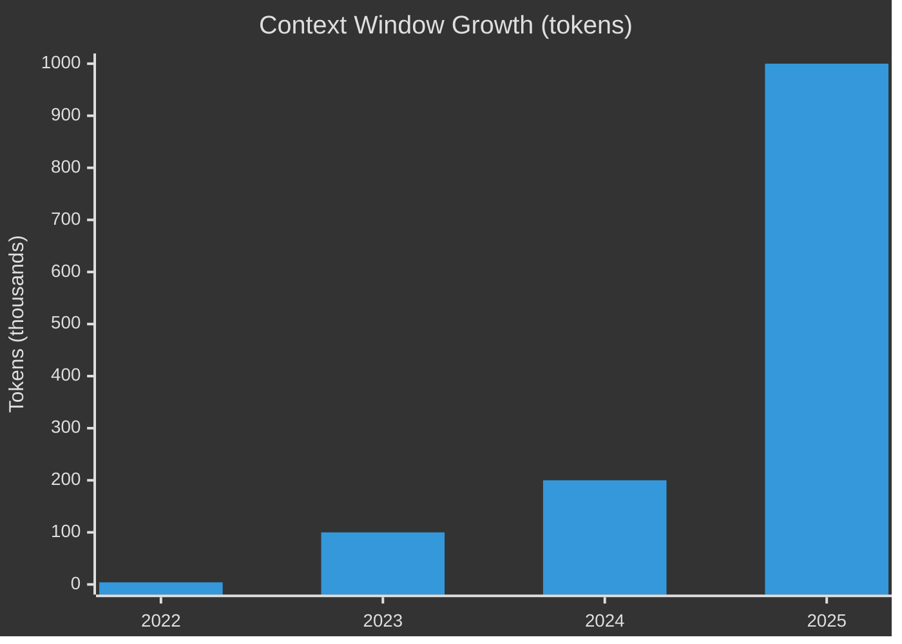
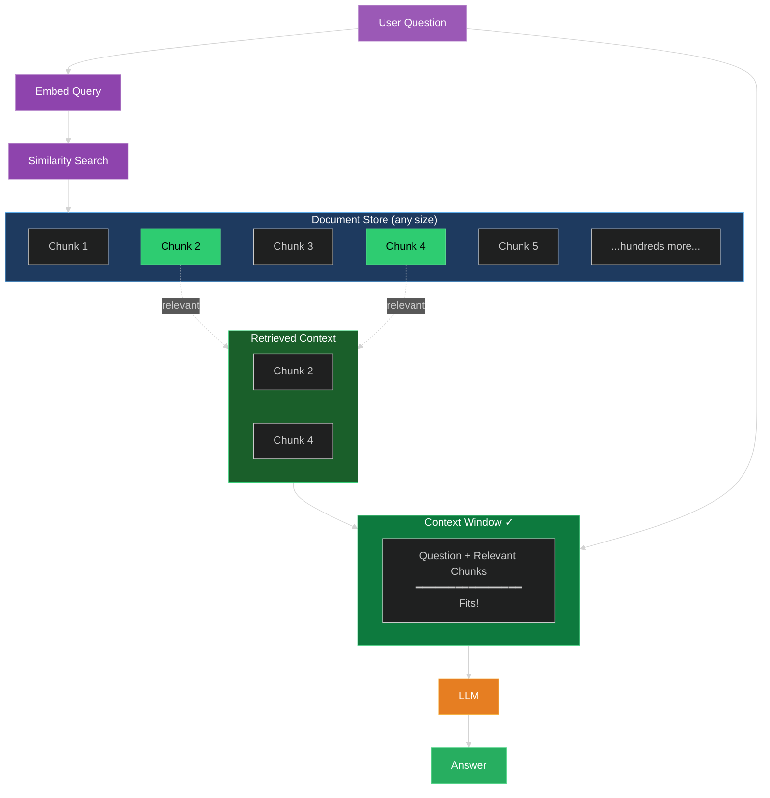

# Context Window Diagrams for RAG Video

These Mermaid diagrams illustrate the context window constraint that RAG solves.

**Note:** Colors optimized for dark themes.

---

## 1. The Problem: Documents Don't Fit

This shows a prompt with limited space — the context window can only hold so much.



Alternative simpler version:



---

## 2. Context Window Evolution

Shows how context windows have grown over time.



Alternative bar-style visualization:



---

## 3. RAG: The Solution

Shows how RAG retrieves only relevant chunks that fit.



---

## 4. What Are Embeddings?

Shows how similar concepts cluster together in vector space.

**Diagram 4a: Similar concepts cluster together**

```
        EMBEDDING SPACE (2D projection of 384+ dimensions)

                         Dimension 2
                             ↑
                             │
          🏙️ CITIES          │          🍎 FRUITS
                             │
            Minneapolis ●    │        ● pear
                             │
               Detroit ●     │     ● apple
                             │
               Chicago ●     │   ● banana
                             │
                             │       ● orange
        ─────────────────────┼─────────────────────→ Dimension 1
                             │
                             │
          🐕 ANIMALS         │
                             │
                   dog ●     │
                             │
                   cat ●     │
                             │
                rabbit ●     │
                             │

        Key insight: Words with similar meanings
        end up near each other in vector space.
```

**Diagram 4b: How RAG retrieval works**

```
        QUERY: "What fruits are high in vitamin C?"

                         Dimension 2
                             ↑
                             │
          🏙️ CITIES          │          🍎 FRUITS
                             │
            Minneapolis ●    │        ● pear
                             │            ╲
               Detroit ●     │     ● apple ─── ★ QUERY VECTOR
                             │            ╱     "fruits...vitamin C"
               Chicago ●     │   ● banana
                             │
                             │       ● orange ←─── MATCH (0.94)
        ─────────────────────┼─────────────────────→ Dimension 1
                             │
                             │
          🐕 ANIMALS         │
                             │
                   dog ●     │     The query embeds IN the fruit
                             │     cluster because it's semantically
                   cat ●     │     similar. RAG retrieves the
                             │     nearest chunks.
                rabbit ●     │
                             │

        Similarity scores: orange (0.94), apple (0.92), pear (0.89)
        These chunks get sent to the LLM as context.
```

### Key Teaching Points for Embeddings

When showing this diagram, emphasize:

1. **Similar meanings → nearby vectors**
   - "apple" and "banana" are close because they're both fruits
   - "Chicago" and "Detroit" are close because they're both Midwest cities

2. **The actual dimensions are abstract**
   - Real embeddings have 384, 768, or 1536 dimensions
   - We project down to 2D just to visualize

3. **Distance = semantic similarity**
   - RAG finds chunks whose vectors are closest to your question's vector
   - That's how it knows which text is "relevant"

---

## Usage Notes

These diagrams can be rendered:
- **Mermaid Live Editor**: https://mermaid.live
- **VS Code**: With Mermaid preview extension
- **GitHub**: Renders Mermaid in markdown automatically
- **Export**: Render to PNG/SVG for video overlay

For the video:
1. Diagram #1 — "The Problem" (documents don't fit)
2. Diagram #2 — "Context windows are growing" (timeline)
3. Diagram #3 — "How RAG solves this" (retrieval flow)
4. Diagram #4a — "What embeddings are" (clustering)
5. Diagram #4b — "How retrieval works" (query vector)
